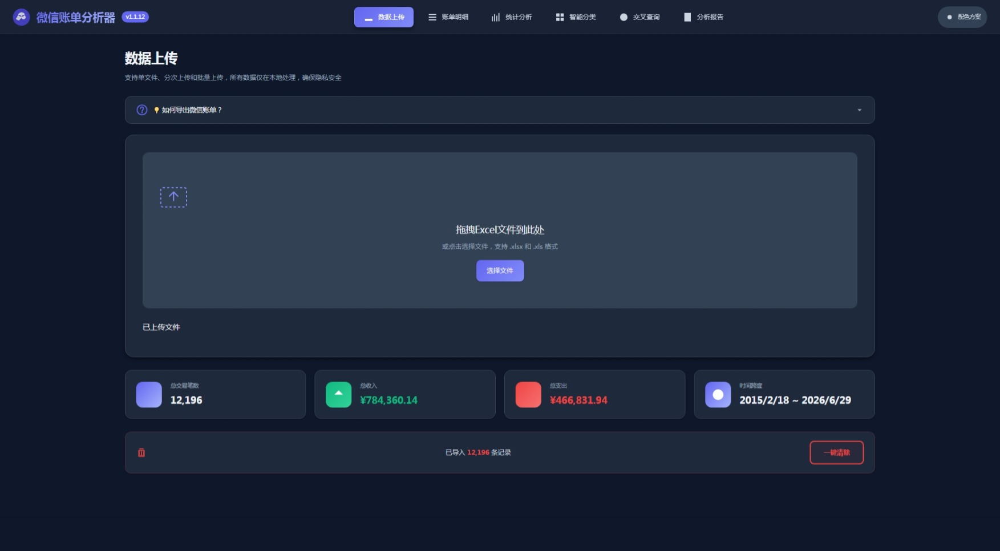
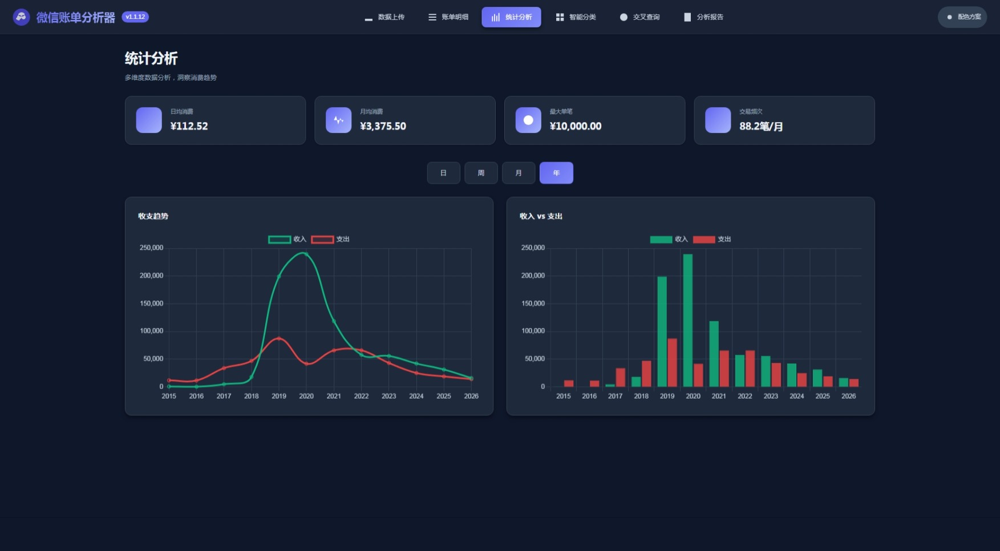
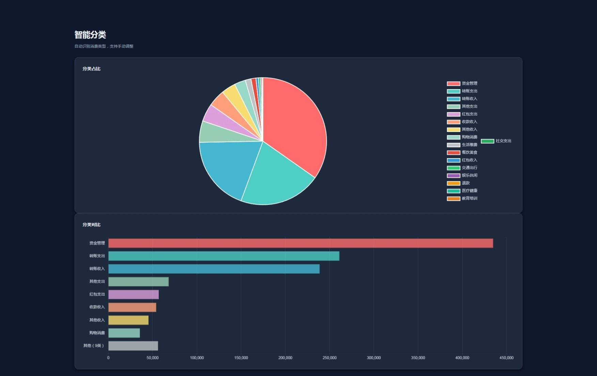
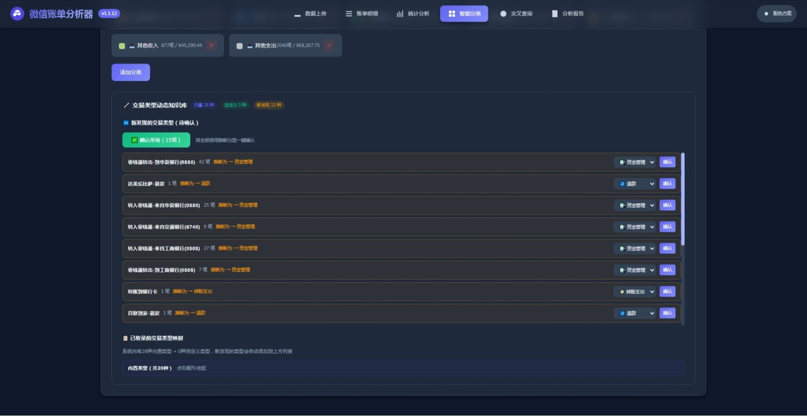
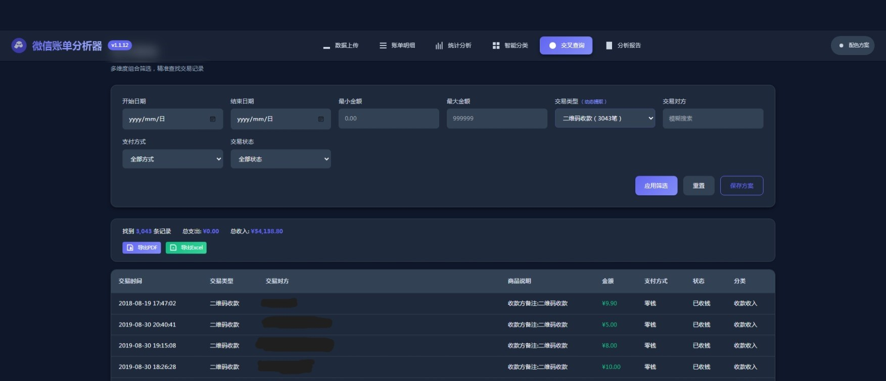

# 微信账单分析器 v1.1.14

> 🔒 纯前端、零后端的微信账单可视化分析工具 —— **所有数据在浏览器本地处理，隐私零泄露。**

## 项目简介

微信账单分析器是一款**纯前端、零依赖框架**的个人财务分析工具。上传微信官方导出的 `.xlsx` 账单文件后，即可在浏览器中完成：

- 📊 **多维度统计**：日/周/月/年 4 时间维度的收支趋势分析
- 🤖 **智能分类**：28 种交易类型 + 商户关键词自动归类，支持学习纠偏
- 🔍 **交叉查询**：8 字段组合筛选，动态级联下拉，PDF/Excel 双格式导出
- 📑 **消费报告**：一键生成含异常检测与优化建议的可视化报告
- 🎨 **双主题 UI**：玻璃拟物风格，深色/浅色一键切换
- 📱 **全端适配**：320px 手机至 2560px 桌面，响应式无缝适配

基于 **HTML5 + CSS3 + 原生 JavaScript (ES6+)** 实现，所有第三方库（SheetJS、Chart.js、html2canvas、jsPDF）均已本地化打包至 `libs/`，**不发起任何网络请求**。

### 项目亮点

| 特色 | 说明 |
|------|------|
| 🛡️ **零隐私泄露** | 解析/计算/渲染均在浏览器完成，数据仅存 LocalStorage |
| 📦 **零安装运行** | 双击 `index.html` 即可使用，无需 Python/Node.js/数据库 |
| 🌐 **完全离线** | 所有依赖本地化，无网络环境也能全功能使用 |
| 📱 **响应式布局** | 自适应 320px ~ 2560px 全尺寸屏幕 |
| 🎨 **玻璃拟物设计** | 现代化的半透明毛玻璃视觉风格 |
| 🔄 **智能分类学习** | 自动检测未识别交易类型，一键确认入库 |
| 📤 **多格式导出** | PDF 报告、Excel 数据、PNG 图片三种导出格式 |

### 适用人群

- 需要进行**年度消费复盘**的微信用户
- 需要**导出 PDF 报告**用于记账、报销、理财的场景
- 关注**数据隐私**、不愿将账单上传至第三方服务的用户
- 经常在**手机/平板/电脑**多端切换使用的用户

---

## 页面预览

### 1. 数据上传

拖拽/点击上传微信账单文件，实时解析进度，展示汇总卡片。



- 拖拽或点击上传 `.xlsx`/`.xls`，支持批量
- 解析进度条实时反馈
- 4 个汇总卡片：总交易笔数 / 总收入 / 总支出 / 时间跨度
- 「💡 如何导出微信账单？」教程入口 + 「一键清除」按钮

### 2. 账单明细

完整交易明细表格，支持搜索、排序、分页、逐条修改分类。


- 8 个字段列：交易时间 / 交易类型 / 交易对方 / 商品说明 / 金额 / 支付方式 / 状态 / 分类
- 模糊搜索（交易对方、商品说明）+ 4 种排序 + 分页（20/50/100 条）
- 基于「微信订单号 + 交易时间」双键自动去重

### 3. 统计分析

4 核心指标卡片 + 收支趋势折线图 + 收支对比柱状图，按日/周/月/年切换。



- 关键指标：日均消费 / 月均消费 / 最大单笔 / 交易频次
- 日/周/月/年 时间维度切换
- 绿色收入线 + 红色支出线双曲线图表

### 4. 智能分类（概览）

饼图 + 柱状图双视图展示分类占比与金额排序。



- 16+ 预置分类：购物消费、餐饮美食、交通出行、生活缴费、娱乐休闲、数码电器、教育学习、医疗保健、旅行住宿等
- 饼图点击图例可显示/隐藏分类，柱状图按金额降序排列

### 5. 智能分类（类型管理）

交易类型知识库管理面板，自动检测未知类型，一键确认入库。



- **新增的未确认交易类型**：批量或逐条确认
- **已发现的交易类型映射**：逐行调整分类归属
- **已收录交易类型列表**：28 种内置类型（零钱、微信红包、转账、群收款、商户消费、信用卡还款、充值、提现、理财通等）

### 6. 交叉查询

8 字段组合筛选，动态级联下拉，独立分页，PDF/Excel 双格式导出。



- 筛选字段：日期范围 / 金额区间 / 交易类型 / 交易对方 / 支付方式 / 交易状态
- 动态级联：下拉选项从实际数据自动提取，相互联动
- 修改任一条件即时刷新结果，无需手动点击
- 统计汇总行 + 独立分页 + 命名保存筛选方案

### 7. 分析报告

自动生成 5 大模块图文报告，支持打印及 PDF/图片导出。


- **5 模块**：消费习惯总结 → 高频消费 Top 10 → 趋势分析图 → 异常交易（2σ 检测）→ 优化建议
- **修复**：v1.1.11 解决深色主题 PDF 导出白字白底问题，强制白底深色文字

### 8. 移动端

独立品牌栏 + 折叠导航菜单，完整的触摸优化与响应式适配。


- **品牌栏独立置顶**（v1.1.13）：应用名 + 版本号单独一行
- 折叠「更多菜单」展开 6 个页面入口
- 横屏使用图表效果更佳，按钮尺寸适配触控

---

## 快速开始

### 系统要求

| 项目 | 最低要求 | 推荐配置 |
|------|---------|---------|
| 操作系统 | Windows 7+ / macOS 10.13+ / Linux | Windows 10/11、macOS 12+ |
| 浏览器 | Chrome 90+ / Edge 90+ / Firefox 88+ / Safari 14+ | Chrome / Edge 最新版 |
| 屏幕分辨率 | 1024×768 | 1920×1080 |
| 存储空间 | ≥ 5 MB | 50 MB+ |

### 文件清单

```
wechatbill/
├── index.html                  # 入口页面
├── README.md                   # 本文档
├── css/
│   └── style.css               # 全局样式（含移动端品牌栏）
├── js/
│   ├── app.js                  # 主入口、事件绑定
│   ├── parser.js               # Excel 解析
│   ├── typeManager.js          # 交易类型动态知识库
│   ├── classifier.js           # 智能分类
│   ├── stats.js                # 统计分析
│   ├── chart.js                # 图表渲染
│   ├── report.js               # 报告生成
│   └── utils.js                # 工具函数
├── libs/                       # 第三方库（本地化）
│   ├── tailwind.min.css
│   ├── chart.umd.min.js
│   ├── xlsx.full.min.js
│   ├── html2canvas.min.js
│   └── jspdf.umd.min.js
└── img/                        # 页面截图
    ├── 1.账单上传页面.jpg
    ├── 2.账单明细页面.jpg
    ├── 3.统计分析页面.jpg
    ├── 4.智能分类页面1.jpg
    ├── 5.智能分类页面一键确定添加新分类.jpg
    ├── 6.功能最强大的交叉查询页面.jpg
    ├── 7.分析报告页面.jpg
    └── 8.移动端界面.jpg
```

### 安装方式

**方式一：直接双击（推荐普通用户）**

解压后双击 `index.html`，浏览器自动打开即可使用。

> ⚠️ `file://` 协议下部分浏览器可能限制 LocalStorage，建议方式二。

**方式二：本地 HTTP 服务器**

```bash
# Python 3
cd wechatbill && python -m http.server 8000

# Node.js（需先 npm install -g http-server）
cd wechatbill && http-server -p 8080

# VS Code Live Server 插件
右键 index.html → Open with Live Server
```

**方式三：部署到云端**

将整个目录上传至 GitHub Pages / Vercel / Netlify / 腾讯云 EdgeOne Pages 等静态托管平台。部署后仍全部在浏览器本地处理数据，服务端不存储任何信息。

### 获取微信账单

1. 微信 → 我 → 服务 → 钱包 → 账单
2. 右上角「···」→「下载账单」→ 选择「用于个人对账」
3. 自定义时间（最多 1 年）→ 交易类型「全部」→ 验证身份
4. 收到「微信支付」公众号推送 → 在浏览器中打开 → 下载 `.xlsx`
5. 通过 USB / 文件助手传到电脑

> 💡 微信每次最多导出 1 年账单，多年数据可分多次下载后批量上传。

### 上传使用

1. 在「数据上传」页面，拖拽 `.xlsx` 文件到上传区域（或点击选择，支持批量多选）
2. 应用自动解析并展示进度条
3. 完成后显示已上传文件列表 + 4 个汇总卡片
4. 数据自动合并去重（基于订单号 + 交易时间），重复上传不会产生重复记录

---

## 各页面操作指引

### 数据上传

| 操作 | 步骤 |
|------|------|
| 上传文件 | 拖拽或点击「选择文件」 |
| 查看教程 | 点击「💡 如何导出微信账单？」 |
| 清除数据 | 点击「一键清除」→ 二次确认 |

### 账单明细

| 操作 | 步骤 |
|------|------|
| 搜索 | 顶部搜索框输入关键词 |
| 排序 | 最新优先 / 最早优先 / 金额降序 / 金额升序 |
| 翻页 | 底部「上一页 / 下一页」 |
| 调整条数 | 下拉选择 20 / 50 / 100 |
| 修改分类 | 点击「分类」列单元格 → 选择新分类 |

### 统计分析

| 操作 | 步骤 |
|------|------|
| 切换维度 | 点击「日 / 周 / 月 / 年」 |
| 查看趋势 | 鼠标悬停折线图查看数值 |
| 对比收支 | 查看右侧柱状图 |

### 智能分类

| 操作 | 步骤 |
|------|------|
| 批量确认未知类型 | 点击「一键确认所有」 |
| 逐条调整 | 修改分类归属 → 点击「确认」 |
| 添加新分类 | 分类规则管理区 → 「添加分类」→ 命名 + 选色 → 保存 |
| 查看知识库 | 浏览「已收录的交易类型列表」 |

### 交叉查询

| 操作 | 步骤 |
|------|------|
| 设置条件 | 填写日期/金额/类型/对方/支付方式/状态（自动即时筛选） |
| 查看结果 | 统计行 + 结果表格 + 独立分页 |
| 保存方案 | 设置条件 → 点击「保存方案」→ 命名 |
| 重置 | 点击「重置」清空所有条件 |
| 导出 PDF | 点击「导出 PDF」 |
| 导出 Excel | 点击「导出 Excel」 |

### 分析报告

| 操作 | 步骤 |
|------|------|
| 生成报告 | 点击「生成报告」，等待 2-5 秒 |
| 导出 PDF | 点击「导出 PDF」 |
| 导出图片 | 点击「导出图片」 |
| 打印 | 点击「打印报告」 |

---

## 高级技巧

**跨年数据合并**：分别导出各年份账单 → 一次性拖入多个文件 → 自动合并去重。

**自定义分类规则**：智能分类页 → 找到未归类交易类型 → 修改分类 → 确认。规则持久化保存。

**保存常用筛选**：交叉查询页 → 设置条件（如「2024 餐饮」）→ 保存方案 → 下次直接调用。

**主题切换**：导航栏「配色方案」按钮，偏好自动保存至 LocalStorage。

**移动端最佳实践**：横屏图表更佳；复杂查询建议桌面端；移动端随时查看已有报告。

---

## 故障排查

| 问题 | 解决方案 |
|------|---------|
| 双击 `index.html` 无反应 | 改用 HTTP 服务器方式启动 |
| 上传后无数据 | 确认文件为微信官方 `.xlsx`（非 `.csv`） |
| 存储空间不足 | 清除浏览器 LocalStorage 或分批管理 |
| PDF 文字模糊 | v1.1.11 已修复，强制白底深色文字 |
| 图表空白 | 切换时间维度或刷新页面 |
| 移动端菜单打不开 | 点击右上角「更多菜单」 |
| 分类识别错误 | 智能分类页手动调整并确认规则 |

---

## 技术架构

### 技术栈

| 技术 | 用途 |
|------|------|
| HTML5 / CSS3 | 语义化页面 + Grid/Flexbox 布局 + CSS 变量主题 |
| JavaScript ES6+ | 原生实现，零框架依赖（无 Vue/React/jQuery） |
| SheetJS | Excel 文件解析 |
| Chart.js | 折线图/柱状图/饼图渲染 |
| html2canvas | DOM → 图片转换 |
| jsPDF | PDF 文档生成 |

### 设计特点

- **玻璃拟物（Glassmorphism）**：半透明毛玻璃 + 柔和阴影
- **双主题切换**：深色/浅色一键切换，偏好自动持久化
- **响应式三级断点**：手机 ≤768px / 平板 768-1023px / 桌面 ≥1024px
- **移动端独立品牌栏**（v1.1.13）：应用名 + 版本号独立置顶行

### 数据存储

所有数据存储于浏览器 **LocalStorage**（上限 5-10 MB，约 3000-5000 条记录）：

| Key | 内容 | 大小 |
|-----|------|------|
| `wechatbill_transactions` | 交易记录 JSON | ~1 KB/条 |
| `wechatbill_categories` | 自定义分类规则 | ~10 KB |
| `wechatbill_type_knowledge` | 交易类型知识库 | ~5 KB |
| `wechatbill_theme` | 主题偏好 | <1 KB |
| `wechatbill_saved_filters` | 筛选方案 | ~5 KB/个 |

刷新页面数据不丢失；清除浏览器数据即彻底删除；存储超限时自动提示。

### 隐私安全

- 所有数据处理在浏览器本地完成，**不发起网络请求**
- 账单数据不离开您的设备
- 第三方库均已本地化，可完全离线运行
- 清除浏览器数据即可完全删除所有记录

---

## 浏览器兼容性

| 浏览器 | 最低版本 | 推荐版本 |
|--------|---------|---------|
| Chrome | 90+ | 最新版 |
| Edge | 90+ | 最新版 |
| Firefox | 88+ | 最新版 |
| Safari (macOS) | 14+ | 最新版 |
| Safari (iOS) | 14+ | 最新版 |
| Chrome (Android) | 90+ | 最新版 |
| 微信内置浏览器 | 最新版 | 最新版 |

---

## 版本历史

| 版本 | 日期 | 主要变更 |
|------|------|---------|
| v1.1.14 | 2026-06-30 | README 重构：消除冗余，合并重复板块，优化层级 |
| v1.1.13 | 2026-06-30 | 移动端品牌名称与版本号独立置顶显示 |
| v1.1.12 | 2026-06-30 | 教程区域移至上传区上方 + 流程步骤更正 |
| v1.1.11 | 2026-06-29 | PDF 导出深色模式白字白底问题修复 |
| v1.1.10 | 2026-06-28 | 报告生成优化 |
| v1.1.7  | 2026-06-27 | 交叉查询 PDF 导出优化 |
| v1.1.4  | 2026-06-26 | 移动端按钮文字优化 |
| v1.1.3  | 2026-06-25 | 交叉查询独立分页修复 |
| v1.0.9  | 2026-06-20 | 一键清除功能 |
| v1.0.8  | 2026-06-15 | 智能分类 28 种交易类型知识库 |
| v1.0.0  | 2026-06-01 | 首个正式版发布 |

---

## 许可证

MIT License

Copyright (c) 2026 AdamShuo

Permission is hereby granted, free of charge, to any person obtaining a copy
of this software and associated documentation files (the "Software"), to deal
in the Software without restriction, including without limitation the rights
to use, copy, modify, merge, publish, distribute, sublicense, and/or sell
copies of the Software, and to permit persons to whom the Software is
furnished to do so, subject to the following conditions:

The above copyright notice and this permission notice shall be included in all
copies or substantial portions of the Software.

THE SOFTWARE IS PROVIDED "AS IS", WITHOUT WARRANTY OF ANY KIND, EXPRESS OR
IMPLIED, INCLUDING BUT NOT LIMITED TO THE WARRANTIES OF MERCHANTABILITY,
FITNESS FOR A PARTICULAR PURPOSE AND NONINFRINGEMENT. IN NO EVENT SHALL THE
AUTHORS OR COPYRIGHT HOLDERS BE LIABLE FOR ANY CLAIM, DAMAGES OR OTHER
LIABILITY, WHETHER IN AN ACTION OF CONTRACT, TORT OR OTHERWISE, ARISING FROM,
OUT OF OR IN CONNECTION WITH THE SOFTWARE OR THE USE OR OTHER DEALINGS IN THE
SOFTWARE.

---

**版本**: 1.1.14 | **更新日期**: 2026-06-30 | **开发者**: [github.com/AdamShuo](https://github.com/AdamShuo)
